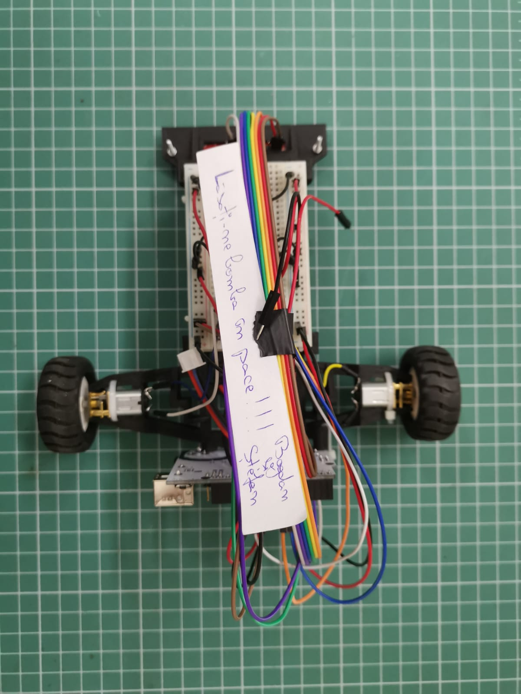
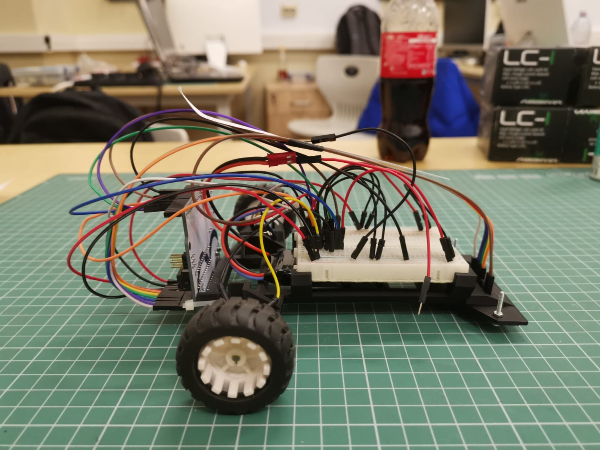
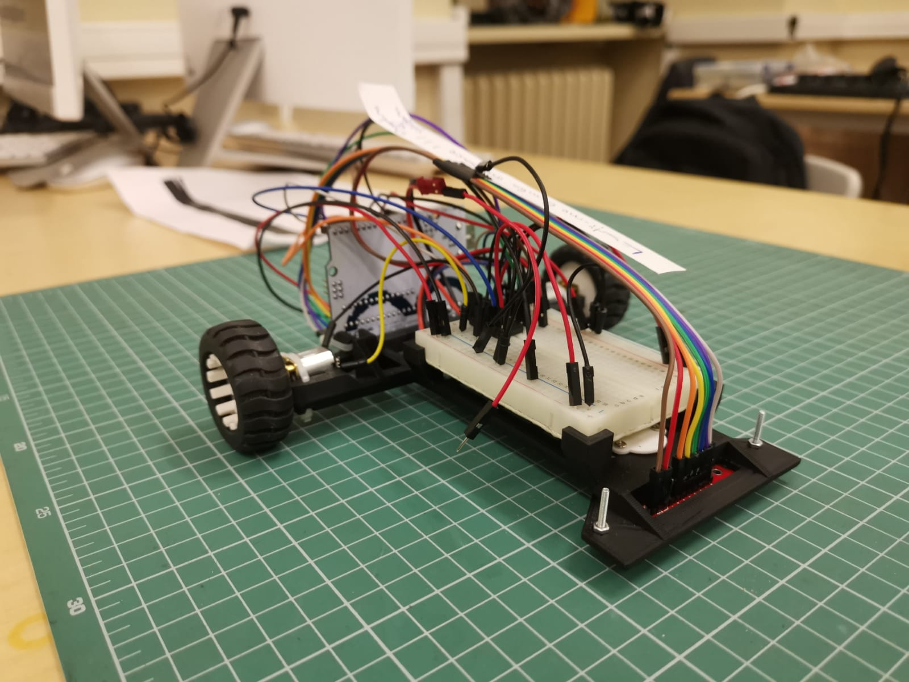
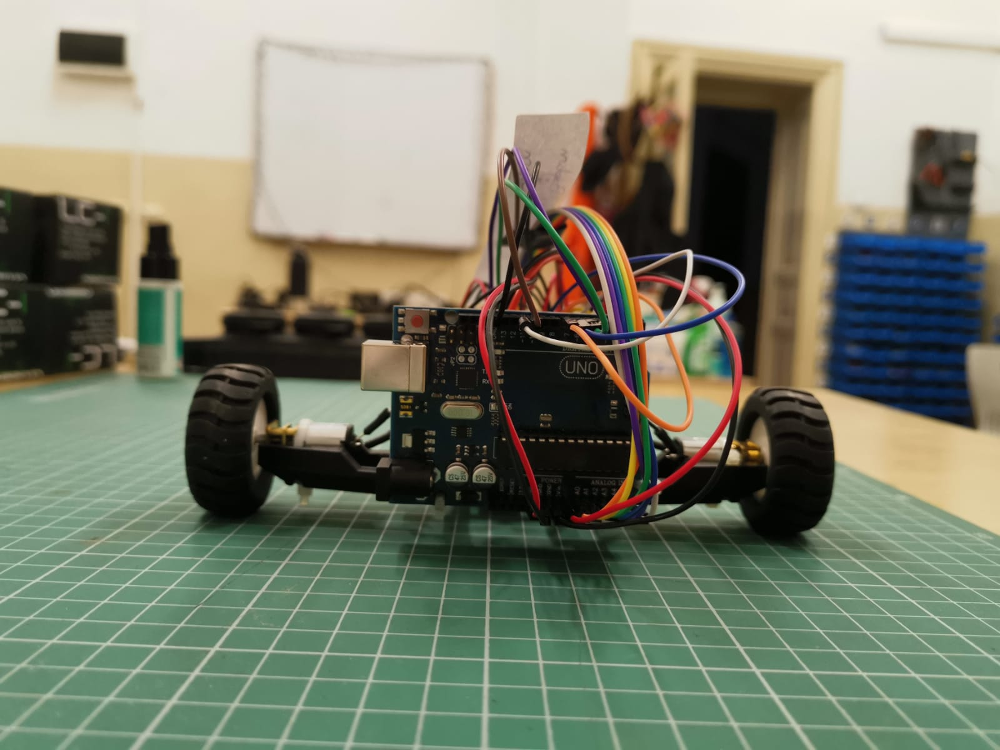
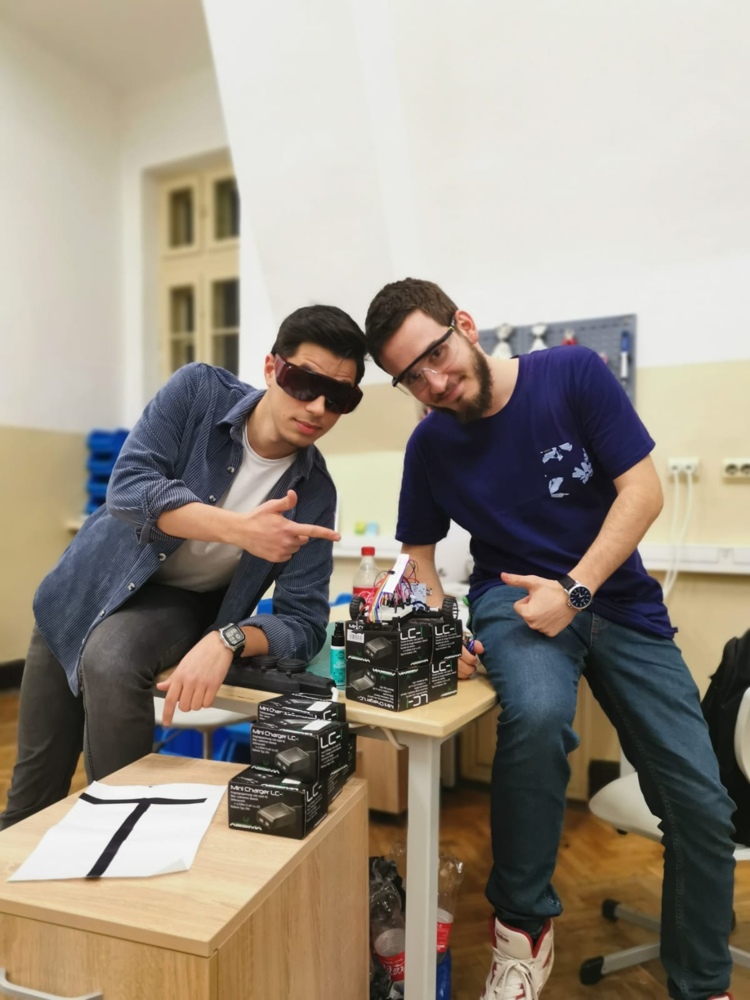

# **Line_Follower**

This is the final project for the Introduction to Robotics course taken in the 3rd year at the Faculty of Mathematics and Computer Science, University of Bucharest.

The project involves making a line follower. The project was carried out together with my teammate Bogdan, [*A-Bogdan*](https://github.com/A-Bogdan) on Github ([link](https://github.com/A-Bogdan/Line_Follower) to the repo of my colleague). 

At the presentation of the project, our line follower, out of the three attempts, took the **best time of 21.761 seconds**.

---

## **Contents**
TBA

---

## **Technical Task.**
We were given a robotics kit and a starter code base. We had to assemble the machine, use 6 of the QTR-8A's sensors and tune the PID. 

The line follower must complete at least one route lap to pass the exam in a decent time. After that, the final grade is obtained according to certain time thresholds. The desired time was about 25 seconds (an average). 

---

## **Components.**
- 1 x Arduino Uno
- 1 x LiPo battery as a power source 
- 1 x L293D motor driver
- 1 x QTR-8A reflectance sensor
- 1 x Breadboard
- 1 x Chassis
- 1 x Ball caster
- 2 x DC motors
- 2 x Wheels
- wires, zip-ties and screws (according to logic)

---

## **Pictures of the setup.**

|  |  | 
|:-------------:|:-------------:|
|  |  |

---

## **Picture of the team.**


---

## **Process explanation.** ([code](./Line%20follower/Line%20follower.ino))
We implemented a machine calibration functionality for each new start. The calibration is based on the information received from the reflectance sensor. The calibration is performed at each new start because the test environment can be different: the colors intensity can be different or the light intensity in the room can be different. So the car adapts to the conditions it is in.

The PID calibrations were made after repeated testing on the test circuits, and the machine wheels speed is adapted accordingly. 

We started by taking values of just the ***P*** until these values made the car roughly follow the line, but which created a large wobble. After that we set values for ***D*** to decrease the wobble effect. Finally, the ***I*** was added to give some finesse to the line follower's movements.

---

## **Video showing our line follower on a test circuit.** [here](https://youtu.be/AiGLdtWanJ4)

As you can see in the video, our tracker did very well on the winding part of the trail. But, on the straight line section, the car was accelerating like Max Verstappen, but was forgoting to brake, as my colleague Bogdan notes =))

For this we added the following code which causes the car "to brake". 

```
if (error <= -warnningSpotSensorValue) {
    m2Speed -= reduceMotorSpeed;
  } 
  else if (error >= warnningSpotSensorValue) {
    m1Speed -= reduceMotorSpeed;
  }
```

When the sensors in the extremities were registering high error values (i.e. after the straight section there is a tight curve), the car was reduceing its speed considerably.

---

## **Video showing our line follower on the final presentation.** [here](https://youtu.be/Jh95sQ5jw9s)

The first run of the line follower goes well, but the second run it crashes. The curve being much too tight, it leaves the sensor's coverage area. But after a hard kick to the floor, the line follower "shakes himself off" and moves on :joy: On the next two laps, the car slows down way too much in that corner and risks stalling. 

We realized that this happened because the base speed of the line follower was left too low and the braking code shown above was slowing it down too much. Because that curve was way too tight, it stopped. In addition we believe that if we had provided some higher error thresholds of the reading of the refraction sensors, we would have avoided this incident.

---